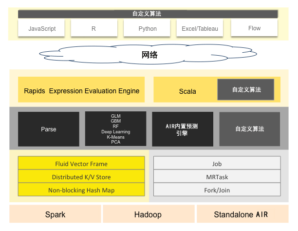
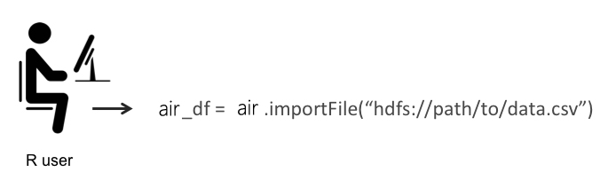
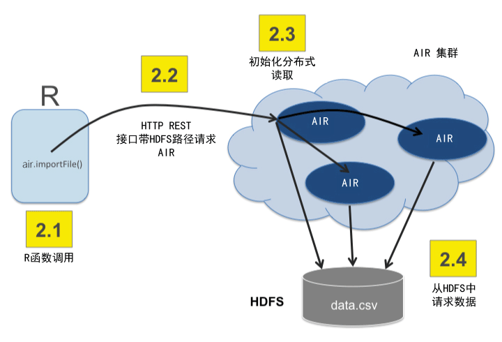
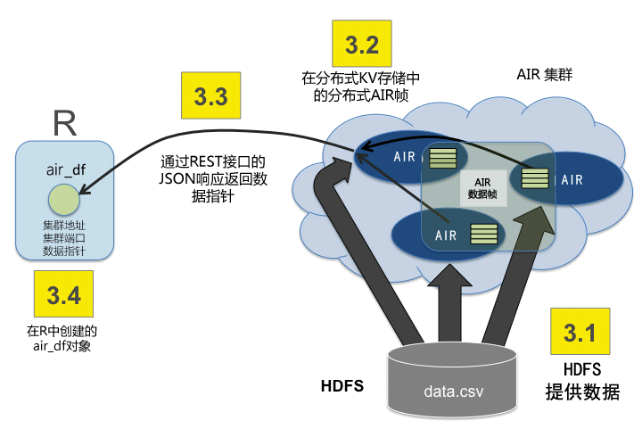
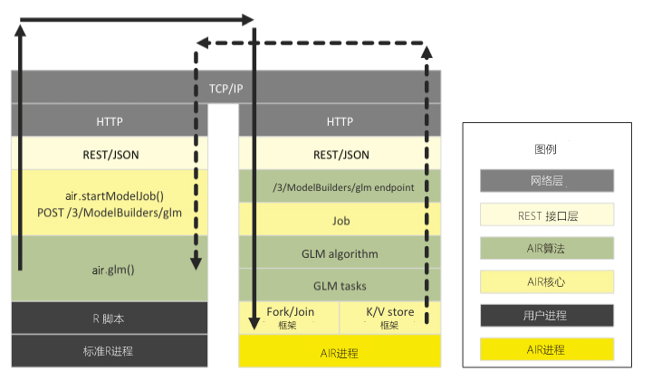
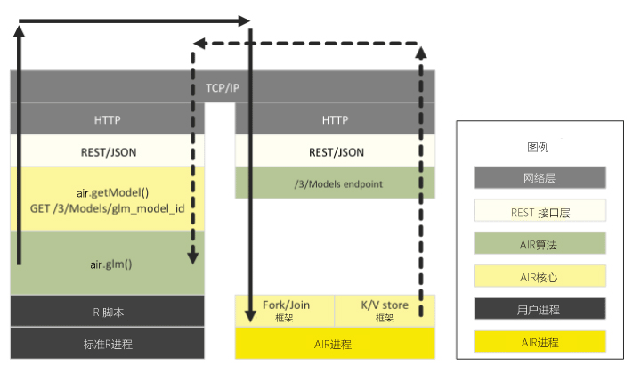
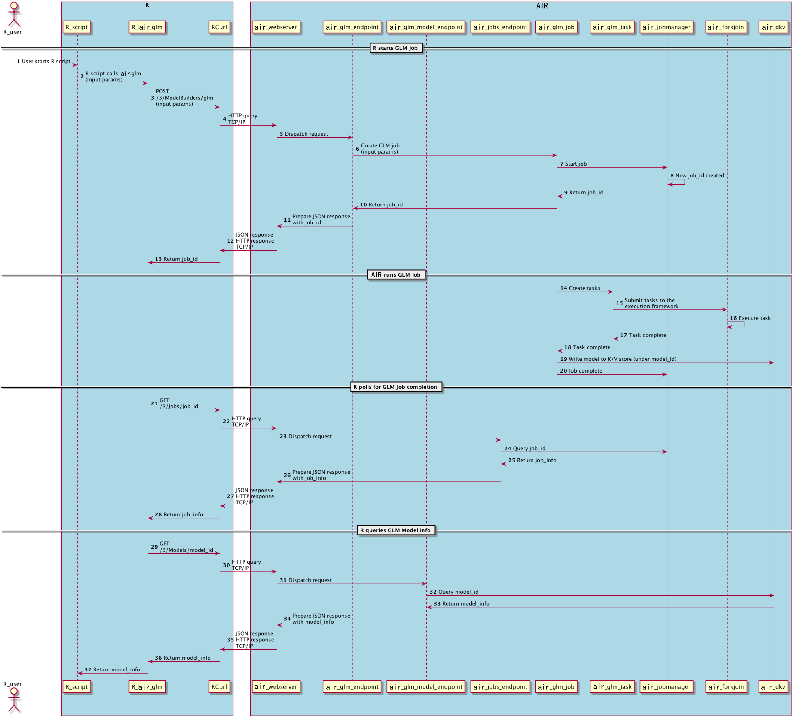

AIR架构
================

AIR技术栈
------------------

下图显示了组成AIR软件栈的大部分不同组件。图被划分为顶部和底部两个部分，网络云将这两个部分划分开来。

顶部部分显示了AIR存在的一些不同的REST API客户端。

底部部分显示了在AIR JVM进程中运行的不同组件。

图中的配色方案以一致的颜色显示每一层，但始终将用户添加的自定义算法代码显示为灰色。

   

REST API 客户端
------------------
所有REST API客户端都通过socket连接与AIR通信。

**JavaScript**
 嵌入式AIR Web UI是用JavaScript编写的，并使用标准的REST API。

**R**
 R脚本可以使用AIR的R包 ['library(air)']。用户可以编写自己的R函数，在AIR上运行 'apply' 或 'ddply'。

**Python**
 Python脚本当前必须直接使用REST API。为python开发一个AIR客户端API已在规划中。

**Excel**
 可以使用Microsoft Excel的AIR工作表。它允许您将大数据集导入AIR并直接从Excel中运行GLM之类的算法。

**Tableau**
 用户可以从AIR中提取结果，以便在Tableau中进行可视化。

**Flow**
 AIR Flow是AIR的笔记型Web UI。

JVM组件
~~~~~~~~~~~~~~

AIR集群由一个或多个节点组成。每个节点都是一个JVM进程。每个JVM进程被分成三个层:语言、算法和核心基础设施。

语言层由R的表达式计算引擎和Shalala Scala层组成。R评估层是R REST客户端前端的一个从属层。Scala层是一等公民，您可以在其中编写使用AIR的本地程序和算法。

算法层包含内置提供的AIR算法。这些是用于导入数据集的解析算法、数学和机器学习算法(如GLM)，以及用于模型评估的预测和评分引擎。

底层(核心)处理资源管理。内存和CPU在这个级别上进行管理。

内存管理
^^^^^^^^^^^^^^^^^

**Fluid Vector Frame**
 Frame是AIR的数据帧，向用户暴露的基本数据存储单元。 "Fluid Vector"（流体矢量） 是一个流行的内部工程术语。它指的是能够“流畅地”添加、更新和删除框架中的列（相对于帧是刚性和不可变的）。存储在内存中的Frame->向量->块->Element taxonomy在Javadoc有具体描述。流体矢量(或fvec)代码是用列压缩存储实现的。

**分布式K/V存储**
 分散在集群中的原子的、分布式的内存存储。

**非阻塞 Hash Map**
 用于K/V存储实现。

CPU管理
^^^^^^^^^^^^^^

**Job**
 作业是具有进度条的大型工作，可以在Web UI中监视。模型创建是作业的一个例子。

**MRTask**
 MRTask代表MapReduce任务。这是一个AIR内存中的MapReduce任务，不要与Hadoop MapReduce任务混淆。 

**Fork/Join**
 修改过的JSR166y轻量级任务执行框架。

R(和Python)如何与AIR交互
-------------------------------------

R的AIR包允许R用户从R脚本控制AIR集群。R脚本是AIR集群的一个REST API客户端，数据本身不在R中计算。

注意，尽管这些示例是针对R的，但Python和Python的AIR包的行为完全相同。

R脚本如何告诉AIR读取数据
~~~~~~~~~~~~~~~~~~~~~~~~~~~~~~~~~~~~~

以下三个步骤的序列展示了R程序如何告诉AIR集群将数据从HDFS读入分布式AIR数据帧。

**Step 1: R用户调用importFile函数**

**Step 2: R客户端告诉集群读取数据**

细箭头展示了控制信息。

**Step 3: 数据从HDFS转化为分布式AIR帧后返回**

细箭头展示了控制信息。粗箭头表示从HDFS返回的数据。数据块位于分布式AIR帧集群内存中。

R脚本如何调用AIR广义线性模型
~~~~~~~~~~~~~~~~~~~~~~~~~~~~~~~~

下图显示了当用户运行一个在AIR上启动GLM的R程序时所涉及的不同软件层。

左边显示运行R进程的步骤，右边显示在H2O集群中运行的步骤。 顶层是TCP/IP网络代码，它使两个进程能够彼此通信。

实线显示一个R->AIR请求，虚线显示该请求的响应。

在R程序中，涉及到的不同的组件是:

-  R脚本自身
-  AIR的R包
-  依赖包 (RCurl, rjson等)
-  R核心运行时

下图显示了检索得到的GLM模型的R程序。(未展现部分：GLM模型执行AIR中的子任务，并将结果保存到K/V存储区或R轮询 /3/Jobs 作业URL，以便GLM模型完成。

下面是同一事务的端到端序列图。这为相同的GLM请求和生成的模型提供了R和AIR交互的不同视角。

R表达式如何发送到AIR进行计算
~~~~~~~~~~~~~~~~~~~~~~~~~~~~~~~~~~~~~~~~~~~~~~~~

H2O数据帧在R中由类AIRFrame的S3对象表示。S3对象有一个 ``id`` 属性，它引用AIR中的大数据对象。

AIR的R包为这个新的AIRFrame类重载了诸如 'summary' 和 '+' 之类的通用操作。R核心解析器回调AIR的R包，这些操作通过HTTP连接发送到AIR集群。

AIR集群对导入AIR的数据集的两列执行大数据操作(例如，'+' )，并返回对结果的引用。这个引用存储在R中的一个新的AIRFrame S3对象中。

复杂的表达式被转换成表达式树，并由后端AIR中的Rapids表达式引擎进行计算。
