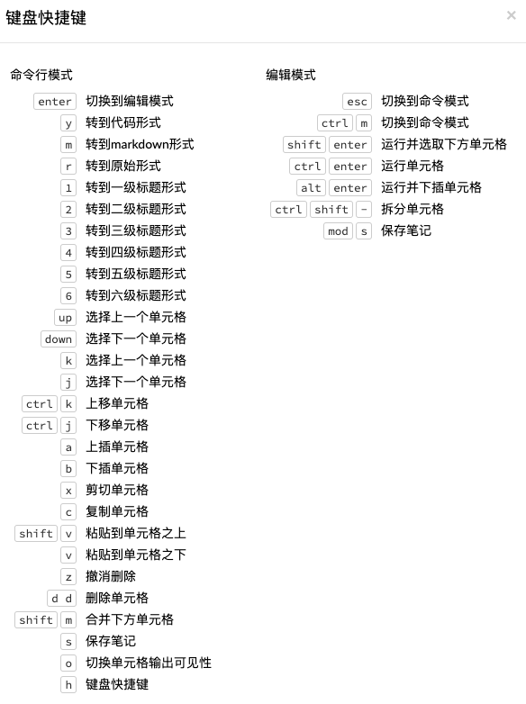

# ... Flow网页用户界面 

>**注意**: 这个主题已经不再维护，关于最新文档的信息，请参阅 [使用Flow - AIR的Web用户界面](https://github.com/Shysoong/air-3/blob/master/h2o-docs/src/product/flow.rst) 主题。

AIR Flow 是一个AIR的开源用户界面。它是一个基于web的交互环境，允许您将代码执行、文本、数学、图表和富媒体组合到一个文档中。AIR Flow，您可以保存、重运行、注释、展现和共享您的工作流。AIR Flow允许您交互式地使用AIR导入文件、构建模型并迭代地改进它们。基于您的模型，您可以做出预测，并添加丰富的文本来创建工作的小插图——所有这些都在Flow，这个基于浏览器的环境中完成。

Flow的混合用户界面无缝地融合了命令行计算和现代图形用户界面。然而，Flow并没有将输出显示为纯文本，而是为每个AIR操作提供了一个可链接和点击的用户界面。它允许您以组织良好的表格数据的形式访问任何H2O对象。

AIR Flow将命令作为可执行单元的序列发送给AIR。单元格可以修改、重新排列或保存到库中。每个单元格包含一个输入字段，允许您输入命令、定义函数、调用其他函数以及访问页面上的其他单元格或对象。当您执行单元格时，输出是一个图形对象，可以检查该图形对象以查看其他详细信息。

虽然AIR Flow支持REST API、R脚本和CoffeeScript，但是运行AIR Flow不需要任何编程经验。您可以通过点击AIR操作来完成任务，而无需编写任何代码。您甚至可以仅使用GUI禁用输入单元格来运行AIR Flow。AIR Flow旨在通过提供输入提示、交互帮助和示例流来指导您的每一步。

## 介绍

本指南将指导您如何使用AIR的web用户界面，要查看AIR Flow的演示视频，请点击<a href="https://www.youtube.com/watch?feature=player_embedded&v=wzeuFfbW7WE" target="_blank">这里</a>。 


---

<a name="GetHelp"></a> 
## 获取帮助 
---

首先，让我们了解一下基础知识。按键盘上`h`查看有用的快捷方式列表。

将显示以下帮助窗口:



要关闭这个窗口，点击右上角**X**，或者点击右下角的**关闭**按钮。您也可以在窗口外侧点击来关闭它。您也可以通过点击**帮助菜单**然后选择**快捷键**来访问快捷键列表窗口。

需要额外的帮助,点击**帮助** > **建模助手** 或者点击在菜单下工具栏中的**建模助手**按钮。

 

您也可以在空白单元格中输入`assist`，然后按 **Ctrl+Enter**。这将显示一个常见任务列表，以帮助您找到正确的命令。

 
 
在 **帮助** 侧边栏中有多个资源可以帮助您开始使用Flow。

>**注意**: 要隐藏侧边栏，点击上方的 **>>** 按钮。 
>
>隐藏的情况下要让侧边栏显示，点击 **<<** 按钮。 

要访问本文档，在帮助侧边栏的 **通用** 标题下选择 **Flow Web 用户界面...** 连接。

您也可以在AIR Flow中探索可用的预先配置好的流程，以演示如何创建一个流程。要查看示例流程：

- 在 **帮助** 侧边栏的 **快速开始视频**按钮下面点击 **查看示例流程** 链接
  
 
   或者 

- 在 **帮助** 侧边栏的 **示例** 区域点击 **浏览已经安装的包...** 链接。点击 **examples** 文件夹然后从列表中选择示例流程。

  

如果当前打开了一个流程，则会出现一个确认窗口，询问是否应该替换当前流程笔记。要加载示例流程，点击 **加载流程笔记** 按钮。

要查看REST API文档，在侧边栏中点击 **帮助** 选项卡，然后选择REST API文档的类型（**Routes** 或者 **Schemas**）。 

 

在开始使用AIR FLow之前，请确保了解不同的单元格模式。某些操作只能在单元格处于特定模式时执行。

---

<a name="Cell"></a>
## 理解单元格模式

单元格有两种模式：编辑模式和命令模式。

<a name="EditMode"></a>
### 使用编辑模式
在编辑模式下，单元格是黄色的，带有一个闪烁的输入提示符，指示文本可以在何处输入，单元格的左侧有一个橙色小旗子。


 
<a name="CmdMode"></a>
### 使用命令模式
 在命令模式下，小旗子黄色的。该标志还指示单元格的格式：

- **MD**: Markdown 
   
   >**注意**：在运行单元格之前不会应用Markdown格式化：
   > 
   >- 点击 **运行** 按钮 
        > 或者
      
   >- 按 **Ctrl+Enter**

 

- **CS**: 代码形式（默认）

 

- **RAW**: 原始形式（用于代码注释） 

 

- **H[1-6]**: 标题级别（1是第一级标题）

 

>**注意**: 如果单元格中有错误，小旗子是红色的。

 
 
 如果单元格正在执行命令，小旗子是青绿色的。当任务完成时，标志变回黄色。 
 
 

### 改变单元格格式

要改变单元格格式（例如，从代码格式到Markdown格式）， 确认您在命令（不是编辑）模式下，并且您想要改变的单元格是选中状态。最简单的方法是单击单元格左侧的旗子，输入您想用的格式的键盘快捷键。旗子上的文本将更改为显示当前格式。 

单元格格式     | 键盘快捷键
------------- | -----------------
Code          | `y`
Markdown      | `m`
Raw text      | `r`
Heading 1     | `1`
Heading 2     | `2`
Heading 3     | `3` 
Heading 4     | `4` 
Heading 5     | `5`
Heading 6     | `6` 


### 运行单元格


菜单下方页面顶部的一系列按钮在流中运行单元格。
 
 

- 要运行流程中所有的单元格，点击 **流程笔记** 菜单，然后点击 **运行所有单元格**。 
- 要运行当前单元格和所有后续单元格，点击 **流程笔记** 菜单，然后点击 **运行后续所有单元格**. 
- 要在流程中运行一个独立的单元格，确认单元格是在[编辑模式](#EditMode)，然后： 

 - 按 **Ctrl+Enter**

     或者
  
 - 单击  **运行** 按钮 


### 运行流程
运行流程时，进度条指示流程的当前状态。您可以通过单击进度栏中的 **结束** 按钮取消当前正在运行的流程。

  

当流程结束时，会在右上角显示一条消息。

  
   
 
>**注意**: 如果流程中有错误，AIR Flow将在包含错误的单元格处停止。 


### 使用键盘快捷键

这里有一些重要的键盘快捷键需要记住：

- 单击单元格并按 **回车** 键进入编辑模式，这允许您更改单元格的内容。
- 要退出编辑模式，按 **Esc** 键。 
- 要执行单元格内容，同时按 **Ctrl** 键和 **回车** 键。

以下命令必须在[命令模式](#CmdMode)下输入。 

- 要在当前单元格 *之上* 新增一个新的单元格，按 **a**。
- 要在当前单元格 *之下* 新增一个新的单元格，按 **b**。
- 要删除当前单元格，*连按两次* **d** 键 (**dd**)。 

您可以通过单击 **帮助** > **键盘快捷键** 或者单击侧边栏的 **帮助选项卡** 来查看这些快捷键。

### 在单元格中使用变量

变量可用于存储诸如下载位置之类的信息。要在Flow中使用变量：

1. 在代码单元格中定义变量（例如， `locA = "https://h2o-public-test-data.s3.amazonaws.com/bigdata/laptop/kdd2009/small-churn/kdd_train.csv"`）。 
  
2. 运行单元格，AIR验证变量。
  
3. 在另一个代码单元格中使用该变量（例如，`importFiles [locA]`）。 
  
为了进一步简化工作流，可以将包含变量和定义的单元格保存为[收藏](#Clips)。


### 使用Flow按钮
在流程名称下方的页面顶部还有一系列按钮，允许您保存当前流程、新增新的单元格、上下移动单元格、运行当前单元格、剪切、复制或者粘贴当前单元格。如果将鼠标悬停在按钮上，将显示该按钮功能的描述。 

 
 
您也可以使用屏幕顶部的菜单来编辑单元格顺序、切换特定格式类型（例如输入或者输出）、构建模型或者评价模型。您还可以访问故障诊断信息或获得有关Flow的帮助。  
 

>**注意**: 要禁用代码输入并严格将AIR Flow用作图形用户界面，单击 **单元格** 菜单，然后单击 **切换单元格可见性**。

现在您已经熟悉了单元格模式，让我们导入一些数据吧。 

---

<a name="ImportData"></a>
# ... 导入数据

如果没有自己的数据可以使用，可以在这里 <a href="http://data.h2o.ai" target="_blank">http://data.h2o.ai</a> 找到一些示例数据集。


在AIR FLow中导入数据有多种方法

- 点击在菜单下面的一排按钮中的 **建模助手** 按钮，然后点击 **导入文件** 链接。在自动补全的 **查找** 条目字段中输入文件路径，然后按 **回车** 键。从搜索结果中选择文件，并通过单击 **添加所有** 链接确认。
 
 
- 在空白单元格中，选择CS格式，然后输入 `importFiles ["path/filename.format"]` （其中`path/filename.format`表示文件的完整文件路径，包括完整的文件名。文件路径可以是本地文件路径或在线地址。） 

>**注意**: 对于S3文件位置，使用这种格式`importFiles [ "s3n:/path/to/bucket/file/file.tab.gz" ]`
  
- 有关如何在R中导入单个文件或目录的示例，请参考下面的[示例](https://github.com/Shysoong/air-2/blob/master/R/tests/testdir_hdfs/runit_s3n_basic.R)。

选择要导入的文件后，文件路径将显示在"查找结果"部分。要导入单个文件，请单击文件旁边的加号。要导入搜索结果中的所有文件，请单击 **添加所有** 链接。选中要导入的文件显示在"选中的文件"部分。


>**注意**: 如果文件是被压缩的，AIR将只使用一个线程读取。为了获得最佳性能，我们建议在导入之前解压文件，因为这将允许在导入期间使用更快的多线程分布式并行读取器。请注意，当前不支持包含多个文件的.zip文件。


- 要导入选择的文件，单击 **导入** 按钮。

- 要从"选中的文件"列表中移除所有文件，单击 **移除所有** 链接。 

- 要移除某一个特定文件，单击文件路径边的 **X** 。 

在您点击 **导入** 按钮之后，当前作业的原始代码会打印出来。摘要显示文件导入的结果，包括导入的文件数量及其网络文件系统(nfs)位置。

 

## 上传数据

要上传一个本地文件，单击 **数据** 菜单然后选择 **上传文件...**。单击 **选择文件** 按钮，选择文件，单击 **选择** 按钮，然后单击 **上传** 按钮。
  
  
  
  当文件被成功上传后，窗口右上角会展示对应信息，并且 **设置解析** 单元格也会展示出来。

  
  

好了，现在您的数据在AIR Flow中已经可用，让我们进入下一步:解析。单击 **解析这些文件** 按钮以继续。

---

<a name="ParseData"></a>
## 解析数据

在导入您的数据之后，应该要解析这些数据了。

 

只读的 **源** 字段显示了所选解析的导入数据的文件路径。

**ID** 包含了自动生成的解析后数据的名称（默认情况下，导入文件的文件名以`.hex`作为文件扩展名）。在此字段中使用默认名称或输入自定义名称。 

从 **解析器** 下拉列表中选择解析器类型(如果需要)。对于大多数数据解析，AIR会自动识别数据类型，因此，默认设置通常不需要更改。以下解析器可供选择：

- Auto
- ARFF
- XLS
- XLSX
- CSV
- SVMLight
- ORC
- AVRO
- PARQUET


   >**注意**: 对于SVMLight数据，列索引必须为>= 1，列必须按升序排列。

如果使用了分隔符，从**分隔符**列表中选取它。

如果适用，选择一个列头选项：

- **自动**： 自动检测列头类型。
- **首行包含列名**：指定列头为列名。
- **首行包含数据**：指定列头为数据。此选项为默认选中。

选择任何必要的附加选项：

- **启用单引号作为字段引号字符**： 将数据中的单引号（也称为撇号）视为字符，而不是枚举.该选项没有被默认选中。
- **完成后删除**：选取复选框以在解析后删除导入的数据。该选项被默认选中。 

在"编辑列名和类型"部分会展示一部分预览数据。


要改变或者新增列名，编辑或在列的输入字段中输入文本。在下面的屏幕截图中，第16列的输入字段以红色高亮显示。  
  
 

要改变列类型，选择列名输入字段右侧的下拉列表并选择数据类型。选项有：
  
  - 未知
  - 数值
  - 枚举
  - 时间
  - UUID
  - 字符串
  - 无效

您可以通过位于第一列的列名输入字段上方的*通过列名查找...*输入字段中输入列名来查找。键入时，AIR将显示与指定搜索项匹配的列。

**注意**： 只有自定义列名是可搜索的。无法搜索默认列名。

若要浏览数据预览，请单击 **<- 前一页**或者 **-> 后一页** 按钮。

  

做出选择后，单击**解析**按钮。

单击**解析**按钮后，将显示当前作业的代码。

 
 
由于我们已经向AIR提交了数个作业（数据导入和解析），现在让我们花点时间来了解更多关于AIR中的作业。
 
--- 
 
<a name="ViewJobs"></a>
## 查看任务

任何您在AIR中输入的命令（诸如 `importFiles`）都是作为任务提交的，它们都与某个特定键关联。该键标识AIR中的任务，并用作引用。

### 查看所有任务

要查看所有的任务，单击**管理**菜单，然后单击**任务作业**，或者在CS（命令行）模式下在单元格中输入`getJobs`。

 

显示以下信息:

- 类型（例如，`Frame` 或者 `Model`）
- 对象的链接
- 任务类型的描述（例如， `Parse` 或者 `GBM`）
- 开始时间
- 结束时间
- 运行时间

要刷新这些信息，单击**刷新**按钮。要查看任务的细节，单击**查看**按钮。

### 查看特定任务

要查看一个特定的任务，单击"最终产物"列中的链接。


显示以下信息: 

- 类型（例如，`Frame`）
- 对象的链接（键）
- 描述（例如，`Parse`）
- 状态
- 运行时间
- 进度

>**注意**：为了更好地理解任务是如何工作的，请确保同时查看[Viewing Frames](#ViewFrames)部分。 
 
好了，现在您已经理解了如何在AIR中查找任务了，让我们通过构建一个模型来提交一个新任务吧。

---

<a name="BuildModel"></a>
# ... 构建模型

要构建一个模型： 

- 在菜单下面的一排按钮中单击**建模助手**，并且选取**构建模型**

  或者 

- 单击**建模助手**按钮，选择**获取数据帧**，然后在解析过的.hex数据集下面单击**构建模型...**

  或者 

- 解析数据后单击**查看**按钮，然后单击**构建模型**按钮

  或者 

- 单击**模型**下拉菜单，然后从列表中选取模型类型


**构建模型...** 按钮可以从包含已解析数据的.hex键的任何页面进行访问（例如，`getJobs` > `getFrame`）。下图描述了K-Means模型类型。可用的选项因模型类型而异。


 

 
在**构建模型**单元格，从下拉菜单中选择一个算法：

<a name="Kmeans"></a>
- **K-means**: 创建一个K-Means模型。

<a name="GLM"></a>
- **Generalized Linear Model**: 创建一个广义线性模型。

<a name="DRF"></a>
- **Distributed RF**: 创建一个分布式随机森林模型。

<a name="NB"></a>
- **Naïve Bayes**: 创建一个朴素贝叶斯模型。

<a name="PCA"></a> 
- **Principal Component Analysis**: 创建一个主成分分析模型用于不需要进行正则化或降维的建模。 

<a name="GBM"></a>
- **Gradient Boosting Machine**: 创建一个梯度推进模型。

<a name="DL"></a>
- **Deep Learning**: 创建一个深度学习模型。


可用的选项根据所选的模型而有所不同。如果一个选项只对特定的模型类型可用，则列出模型类型。如果没有指定模型类型，则该选项适用于所有模型类型。

- **model_id**: (可选) 输入要用作引用的模型的自定义名称。默认情况下，AIR自动生成一个包含模型类型的ID(例如，`gbm-6f6bdc8b-ccbc-474a-b590-4579eea44596`)。 

- **training_frame**: (必须) 选择用于构建模型的数据集。 

- **validation_frame**: (可选) 选择用于评估模型准确性的数据集。 

- **nfolds**: ([GLM](#GLM), [GBM](#GBM), [DL](#DL), [DRF](#DRF)) 指定交叉验证的折叠数。 

- **response_column**: ([GLM](#GLM), [GBM](#GBM), [DL](#DL), [DRF](#DRF), [Naïve Bayes](#NB) 需要) 选择要用作独立变量的列。

- **ignored_columns**: (可选)单击列名旁边的复选框，将其添加到模型排除的列列表中。要添加所有列，单击**全选**按钮。要从忽略列的列表中删除列，请单击列名旁边的X。从被忽略列的列表中删除所有列，单击**全不选**按钮。搜索特定的列，在列列表上方的**查找**字段中输入列名。只显示具有特定丢失值百分比的列，在**只展示缺失超过0%数据的列**字段中指定百分比。更改隐藏列的选择，使用**选择可见**或者**反选可见**按钮。 

- **ignore\_const\_cols**: (可选) 选中此复选框以忽略常数训练列，因为无法从中获得任何信息。该选项默认被选中。

- **transform**: ([PCA](#PCA)) 选择训练数据的转换方法：无、标准化、规范化、Demean或Descale。 
- **pca_method**: ([PCA](#PCA)) 选择计算主成分的算法： 
	- *GramSVD*: 使用Gram矩阵的分布式计算，然后使用JAMA包进行局部SVD
	- *Power*: 利用幂迭代法计算奇异值分解（SVD）
	- *Randomized*: 采用随机子空间迭代法
	- *GLRM*: 拟合了具有L2损失函数且无正则化的广义低秩模型，并利用局部矩阵代数求解奇异值分解

- **family**: ([GLM](#GLM)) 选择模型（指数族分布）类型(Gaussian, Binomial, Multinomial, Poisson, Gamma, or Tweedie)。

- **solver**: ([GLM](#GLM)) 选择要使用的求解器(AUTO, IRLSM, L\_BFGS, COORDINATE\_DESCENT\_NAIVE 或 COORDINATE\_DESCENT). IRLSM可以快速地处理具有少量预测因子的问题，以及L1惩罚的lambda-search， 而 [L_BFGS](http://cran.r-project.org/web/packages/lbfgs/vignettes/Vignette.pdf) 对于具有许多列的数据集，具有更好的伸缩性。 COORDINATE\_DESCENT is IRLSM with the covariance updates version of cyclical coordinate descent in the innermost loop. COORDINATE\_DESCENT\_NAIVE is IRLSM with the naive updates version of cyclical coordinate descent in the innermost loop. COORDINATE\_DESCENT\_NAIVE 和 COORDINATE\_DESCENT 目前还在实验阶段。 

- **link**: ([GLM](#GLM)) 选择link function (Identity, Family_Default, Logit, Log, Inverse, or Tweedie)。

- **alpha**: ([GLM](#GLM)) 指定L2和L2之间的正则化分布。  

- **lambda**: ([GLM](#GLM)) 指定正则化强度。

- **lambda_search**: ([GLM](#GLM)) 勾选复选框以激活lambda search，以最大的lambda值开始，给定的lambda随后递减为最小的lambda值。 

- **non-negative**: ([GLM](#GLM)) 要强制系数为非负，勾选这个复选框。

- **standardize**: ([K-Means](#Kmeans), [GLM](#GLM)) 若要将数值列标准化为零均值和单位方差，请选中此复选框。强烈推荐启用标准化，如果不使用标准化，结果会包含那些被相对于其他属性，在规模上似乎有更大方差的变量主导的组件，而不是真实贡献。该选项默认被选中。 

- **beta_constraints**: ([GLM](#GLM)) 要使用beta约束，从下拉菜单中选择一个数据集。选定的数据帧用于约束系数向量，提供上下界。

- **ntrees**: ([GBM](#GBM), [DRF](#DRF)) 指定树的数量。  

- **max\_depth**: ([GBM](#GBM), [DRF](#DRF)) 指定树的最大深度。

- **min\_rows**: ([GBM](#GBM), [DRF](#DRF)) 指定一个叶子节点的最小观察值 (R中为"nodesize")。 

- **nbins**: ([GBM](#GBM), [DRF](#DRF)) （只适用于数值型 [real/int]）指定用于构建直方图的最小bins数量，然后在最合适的地方分割。

- **nbins_cats**: ([GBM](#GBM), [DRF](#DRF)) （只适用于分类数据类型 [factors/enums]） 指定用于构建直方图的最大bins数量，然后在最合适的地方分割。数值越高越会导致过拟合。The levels are ordered alphabetically; if there are more levels than bins, adjacent levels share bins.该值对模型拟合度的影响比**nbins**更显著。较大的值可能会增加运行时，特别是对于深度树和大型集群，因此可能需要进行调优，以找到配置的最佳值。

- **learn_rate**: ([GBM](#GBM)) 指定学习率。范围是 0.0 到 1.0。 

- **distribution**: ([GBM](#GBM), [DL](#DL)) 从下拉列表中选择分布类型。选项有 auto, bernoulli, multinomial, gaussian, poisson, gamma或tweedie。

- **sample_rate**: ([GBM](#GBM), [DRF](#DRF)) 指定行采样率(x-axis)。范围是0.0到1.0。较高的数值可以提高训练的准确性。当采样列或行时，测试集上精度会提高。更多细节，请参考 "Stochastic Gradient Boosting" ([Friedman, 1999](https://statweb.stanford.edu/~jhf/ftp/stobst.pdf)). 

- **col\_sample_rate**: ([GBM](#GBM), [DRF](#DRF)) 指定列采样率(y-axis)。范围是0.0到1.0。较高的数值可以提高训练的准确性。当采样列或行时，测试集上精度会提高。更多细节，请参考 "Stochastic Gradient Boosting" ([Friedman, 1999](https://statweb.stanford.edu/~jhf/ftp/stobst.pdf)). 

- **mtries**: ([DRF](#DRF)) 指定要在每个级别随机选择的列。如果使用默认值`-1`， 变量数的确定，定于分类问题为列数的平方跟，对于回归问题为 p/3 （这里的p是特征数量）。   
   
- **binomial\_double\_trees**: ([DRF](#DRF)) （只适用于二分类问题） 构建两倍数量的内部树(每个类一个)。 启用此选项可以让结果精度更高，而禁用此选项则可以使模型构建更快。默认情况下此选项被禁用。

- **score\_each\_iteration**: ([K-Means](#Kmeans), [DRF](#DRF), [Naïve Bayes](#NB), [PCA](#PCA), [GBM](#GBM), [GLM](#GLM)) 要在模型训练的每次迭代中计分，请选中此复选框。

- **k***: ([K-Means](#Kmeans), [PCA](#PCA)) 对于K-Means，指定聚类的数量。对于PCA，指定矩阵近似的秩。 

- **user_points**: ([K-Means](#Kmeans)) 对于K-Means，指定初始化聚类中心的个数。 

- **max_iterations**: ([K-Means](#Kmeans), [PCA](#PCA), [GLM](#GLM)) 指定训练迭代的数量。

- **init**: ([K-Means](#Kmeans)) 选择初始化模式，选项有Furthest、PlusPlus、Random或User。 

  >**注意**: 如果选择了PlusPlus，则初始Y矩阵将由K-Means PlusPlus算法的最终集群中心选择。

- **tweedie_variance_power**: ([GLM](#GLM))（仅适用于当**Family**选择了*Tweedie*时）指定Tweedie方差的幂。 

- **tweedie_link_power**: ([GLM](#GLM))（仅适用于当**Family**选择了*Tweedie*时）指定Tweediet link函数的幂。

- **activation**: ([DL](#DL)) 选择激活函数(Tanh, TanhWithDropout, Rectifier, RectifierWithDropout, Maxout, MaxoutWithDropout)。默认选项是Rectifier。

- **hidden**: ([DL](#DL)) 指定隐藏层的大小（例如：100,100）。对于网格搜索，使用都好分割的值：(10,10),(20,20,20)。默认值是[200,200]。指定值必须为正。

- **epochs**: ([DL](#DL)) 指定迭代(流)数据集的次数，值可以是分数。 

- **variable_importances**: ([DL](#DL)) 勾选复选框以计算变量重要性，该选项默认没有被选中。 

- **laplace**: ([Naïve Bayes](#NB)) 指定拉普拉斯平滑参数。 

- **min\_sdev**: ([Naïve Bayes](#NB)) 指定用于没有足够数据的观测量的最小标准差。 

- **eps\_sdev**: ([Naïve Bayes](#NB)) 指定标准差的阈值。如果不满足这个阈值，使用 **min\_sdev** 的值。  

- **min\_prob**: ([Naïve Bayes](#NB)) 指定用于没有足够数据的观测量的最小概率。

- **eps\_prob**: ([Naïve Bayes](#NB)) Specify the threshold for standard deviation. If this threshold is not met, the **min\_sdev** value is used. 

- **compute_metrics**: ([Naïve Bayes](#NB), [PCA](#PCA)) 若要计算训练数据的指标，请勾选此复选框。朴素贝叶斯分类器假设在特定预测变量条件下各特征变量之间的相互独立，以及从训练数据集计算的平均值和标准差的数值预测器服从高斯分布。在构建朴素贝叶斯分类器时，训练数据集中包含至少一个NA的每一行都将被完全跳过。如果测试数据集有缺失值，那么在预测期间的概率计算中将省略这些预测因子。

**高级选项**

- **fold_assignment**: ([GLM](#GLM), [GBM](#GBM), [DL](#DL), [DRF](#DRF), [K-Means](#Kmeans)) (Applicable only if a value for **nfolds** is specified and **fold_column** is not selected) Select the cross-validation fold assignment scheme. The available options are Random or [Modulo](https://en.wikipedia.org/wiki/Modulo_operation). 

- **fold_column**: ([GLM](#GLM), [GBM](#GBM), [DL](#DL), [DRF](#DRF), [K-Means](#Kmeans)) Select the column that contains the cross-validation fold index assignment per observation. 

- **offset_column**: ([GLM](#GLM), [DRF](#DRF), [GBM](#GBM))  选择要用作偏移量的列。
	>*注意*: 偏移量是在模型训练中使用的每行“偏差值”。对于高斯分布，它们可以看作是对response (y)列的简单更正。Instead of learning to predict the response (y-row), the model learns to predict the (row) offset of the response column. For other distributions, the offset corrections are applied in the linearized space before applying the inverse link function to get the actual response values. For more information, refer to the following [link](http://www.idg.pl/mirrors/CRAN/web/packages/gbm/vignettes/gbm.pdf). 

- **weights_column**: ([GLM](#GLM), [DL](#DL), [DRF](#DRF), [GBM](#GBM)) Select a column to use for the observation weights. The specified `weights_column` must be included in the specified `training_frame`. *Python only*: To use a weights column when passing an H2OFrame to `x` instead of a list of column names, the specified `training_frame` must contain the specified `weights_column`. 
	>*注意*: Weights are per-row observation weights and do not increase the size of the data frame. This is typically the number of times a row is repeated, but non-integer values are supported as well. During training, rows with higher weights matter more, due to the larger loss function pre-factor.  

- **loss**: ([DL](#DL)) Select the loss function. For DL, the options are Automatic, Quadratic, CrossEntropy, Huber, or Absolute and the default value is Automatic. Absolute, Quadratic, and Huber are applicable for regression or classification, while CrossEntropy is only applicable for classification. Huber can improve for regression problems with outliers.

- **checkpoint**: ([DL](#DL), [DRF](#DRF), [GBM](#GBM)) Enter a model key associated with a previously-trained model. Use this option to build a new model as a continuation of a previously-generated model.

- **use\_all\_factor\_levels**: ([DL](#DL), [PCA](#PCA)) Check this checkbox to use all factor levels in the possible set of predictors; if you enable this option, sufficient regularization is required. By default, the first factor level is skipped. For Deep Learning models, this option is useful for determining variable importances and is automatically enabled if the autoencoder is selected. 

- **train\_samples\_per\_iteration**: ([DL](#DL)) Specify the number of global training samples per MapReduce iteration. To specify one epoch, enter 0. To specify all available data (e.g., replicated training data), enter -1. To use the automatic values, enter -2. 

- **adaptive_rate**: ([DL](#DL)) Check this checkbox to enable the adaptive learning rate (ADADELTA). This option is selected by default. If this option is enabled, the following parameters are ignored: `rate`, `rate_decay`, `rate_annealing`, `momentum_start`, `momentum_ramp`, `momentum_stable`, and `nesterov_accelerated_gradient`. 

- **input\_dropout\_ratio**: ([DL](#DL)) Specify the input layer dropout ratio to improve generalization. Suggested values are 0.1 or 0.2. The range is >= 0 to <1. 

- **l1**: ([DL](#DL)) Specify the L1 regularization to add stability and improve generalization; sets the value of many weights to 0. 

- **l2**: ([DL](#DL)) Specify the L2 regularization to add stability and improve generalization; sets the value of many weights to smaller values. 

- **balance_classes**: ([GBM](#GBM), [DL](#DL)) Oversample the minority classes to balance the class distribution. This option is not selected by default and can increase the data frame size. This option is only applicable for classification. Majority classes can be undersampled to satisfy the **Max\_after\_balance\_size** parameter.

  >**Note**: `balance_classes` balances over just the target, not over all classes in the training frame. 

- **max\_confusion\_matrix\_size**: ([DRF](#DRF), [DL](#DL), [Naïve Bayes](#NB), [GBM](#GBM), [GLM](#GLM)) Specify the maximum size (in number of classes) for confusion matrices to be printed in the Logs. 

- **max\_hit\_ratio\_k**: ([DRF](#DRF), [DL](#DL), [Naïve Bayes](#NB), [GBM](#GBM), [GLM](#GLM)) Specify the maximum number (top K) of predictions to use for hit ratio computation. Applicable to multinomial only. To disable, enter 0. 

- **r2_stopping**: ([GBM](#GBM), [DRF](#DRF)) r2_stopping is no longer supported and will be ignored if set - please use stopping_rounds, stopping_metric and stopping_tolerance instead.

- **build\_tree\_one\_node**: ([DRF](#DRF), [GBM](#GBM)) To run on a single node, check this checkbox. This is suitable for small datasets as there is no network overhead but fewer CPUs are used. The default setting is disabled. 

- **rate**: ([DL](#DL)) Specify the learning rate. Higher rates result in less stable models and lower rates result in slower convergence. Not applicable if **adaptive_rate** is enabled. 

- **rate_annealing**: ([DL](#DL)) Specify the learning rate annealing. The formula is rate/(1+rate\_annealing value \* samples). Not applicable if **adaptive\_rate** is enabled.

- **momentum_start**: ([DL](#DL)) Specify the initial momentum at the beginning of training. A suggested value is 0.5. Not applicable if **adaptive_rate** is enabled.

- **momentum_ramp**: ([DL](#DL)) Specify the number of training samples for increasing the momentum. Not applicable if **adaptive_rate** is enabled.

- **momentum_stable**: ([DL](#DL)) Specify the final momentum value reached after the **momentum_ramp** training samples. Not applicable if **adaptive_rate** is enabled. 

- **nesterov\_accelerated\_gradient**: ([DL](#DL)) Check this checkbox to use the Nesterov accelerated gradient. This option is recommended and selected by default. Not applicable is **adaptive_rate** is enabled. 

- **hidden\_dropout\_ratios**: ([DL](#DL)) Specify the hidden layer dropout ratios to improve generalization. Specify one value per hidden layer, each value between 0 and 1 (exclusive). There is no default value. This option is applicable only if *TanhwithDropout*, *RectifierwithDropout*, or *MaxoutWithDropout* is selected from the **Activation** drop-down list. 

- **tweedie_power**: ([DL](#DL), [GBM](#GBM)) (Only applicable if *Tweedie* is selected for **Family**) Specify the Tweedie power. The range is from 1 to 2. For a normal distribution, enter `0`. For Poisson distribution, enter `1`. For a gamma distribution, enter `2`. For a compound Poisson-gamma distribution, enter a value greater than 1 but less than 2. For more information, refer to [Tweedie distribution](https://en.wikipedia.org/wiki/Tweedie_distribution). 

- **score_interval**: ([DL](#DL)) Specify the shortest time interval (in seconds) to wait between model scoring.  

- **score\_training\_samples**: ([DL](#DL)) Specify the number of training set samples for scoring. To use all training samples, enter 0.  

- **score\_validation\_samples**: ([DL](#DL)) (Requires selection from the **validation_frame** drop-down list) This option is applicable to classification only. Specify the number of validation set samples for scoring. To use all validation set samples, enter 0.  

- **score\_duty\_cycle**: ([DL](#DL)) Specify the maximum duty cycle fraction for scoring. A lower value results in more training and a higher value results in more scoring. The value must be greater than 0 and less than 1. 

- **autoencoder**: ([DL](#DL)) Check this checkbox to enable the Deep Learning autoencoder. This option is not selected by default. 
   >**Note**: This option requires a loss function other than CrossEntropy. If this option is enabled, **use\_all\_factor\_levels** must be enabled. 

**Expert Options**

- **keep\_cross\_validation\_predictions**: ([GLM](#GLM), [GBM](#GBM), [DL](#DL), [DRF](#DRF), [K-Means](#Kmeans)) To keep the cross-validation predictions, check this checkbox. 

- **class\_sampling\_factors**: ([DRF](#DRF), [GBM](#GBM), [DL](#DL)) Specify the per-class (in lexicographical order) over/under-sampling ratios. By default, these ratios are automatically computed during training to obtain the class balance. This option is only applicable for classification problems and when **balance_classes** is enabled. 

- **overwrite\_with\_best\_model**: ([DL](#DL)) Check this checkbox to overwrite the final model with the best model found during training. This option is selected by default. 

- **target\_ratio\_comm\_to\_comp**: ([DL](#DL)) Specify the target ratio of communication overhead to computation. This option is only enabled for multi-node operation and if **train\_samples\_per\_iteration** equals -2 (auto-tuning).  

- **rho**: ([DL](#DL)) Specify the adaptive learning rate time decay factor. This option is only applicable if **adaptive_rate** is enabled. 

- **epsilon**: ([DL](#DL)) Specify the adaptive learning rate time smoothing factor to avoid dividing by zero. This option is only applicable if **adaptive_rate** is enabled. 

- **max_w2**: ([DL](#DL)) Specify the constraint for the squared sum of the incoming weights per unit (e.g., for Rectifier). 

- **initial\_weight\_distribution**: ([DL](#DL)) Select the initial weight distribution (Uniform Adaptive, Uniform, or Normal). If Uniform Adaptive is used, the **initial\_weight\_scale** parameter is not applicable. 
 
- **initial\_weight\_scale**: ([DL](#DL)) Specify the initial weight scale of the distribution function for Uniform or Normal distributions. For Uniform, the values are drawn uniformly from initial weight scale. For Normal, the values are drawn from a Normal distribution with the standard deviation of the initial weight scale. If Uniform Adaptive is selected as the **initial\_weight\_distribution**, the **initial\_weight\_scale** parameter is not applicable.

- **classification_stop**: ([DL](#DL)) (Applicable to discrete/categorical datasets only) Specify the stopping criterion for classification error fractions on training data. To disable this option, enter -1.  

- **max\_hit\_ratio\_k**: ([DL](#DL), [GLM](#GLM)) (Classification only) Specify the maximum number (top K) of predictions to use for hit ratio computation (for multinomial only). To disable this option, enter 0.  

- **regression_stop**: ([DL](#DL)) (Applicable to real value/continuous datasets only) Specify the stopping criterion for regression error (MSE) on the training data. To disable this option, enter -1.  

- **diagnostics**: ([DL](#DL)) Check this checkbox to compute the variable importances for input features (using the Gedeon method). For large networks, selecting this option can reduce speed. This option is selected by default. 

- **fast_mode**: ([DL](#DL)) Check this checkbox to enable fast mode, a minor approximation in back-propagation. This option is selected by default. 

- **force\_load\_balance**: ([DL](#DL)) Check this checkbox to force extra load balancing to increase training speed for small datasets and use all cores. This option is selected by default. 

- **single\_node\_mode**: ([DL](#DL)) Check this checkbox to force H2O to run on a single node for fine-tuning of model parameters. This option is not selected by default. 

- **replicate\_training\_data**: ([DL](#DL)) Check this checkbox to replicate the entire training dataset on every node for faster training on small datasets. This option is not selected by default. This option is only applicable for clouds with more than one node. 

- **shuffle\_training\_data**: ([DL](#DL)) Check this checkbox to shuffle the training data. This option is recommended if the training data is replicated and the value of **train\_samples\_per\_iteration** is close to the number of nodes times the number of rows. This option is not selected by default. 

- **missing\_values\_handling**: ([DL](#DL), [GLM](#GLM) Select how to handle missing values (Skip or MeanImputation). 

- **quiet_mode**: ([DL](#DL)) Check this checkbox to display less output in the standard output. This option is not selected by default.

- **sparse**: ([DL](#DL)) Check this checkbox to enable sparse data handling, which is more efficient for data with many zero values. 

- **col_major**: ([DL](#DL)) Check this checkbox to use a column major weight matrix for the input layer. This option can speed up forward propagation but may reduce the speed of backpropagation. This option is not selected by default.  
  
  >**Note**: This parameter has been deprecated. 

- **average_activation**: ([DL](#DL)) Specify the average activation for the sparse autoencoder. If **Rectifier** is selected as the **Activation** type, this value must be positive. For Tanh, the value must be in (-1,1). 

- **sparsity_beta**: ([DL](#DL)) Specify the sparsity-based regularization optimization. For more information, refer to the following [link](http://www.mit.edu/~9.520/spring09/Classes/class11_sparsity.pdf).  

- **max\_categorical\_features**: ([DL](#DL)) Specify the maximum number of categorical features enforced via hashing. 

- **reproducible**: ([DL](#DL)) To force reproducibility on small data, check this checkbox. If this option is enabled, the model takes more time to generate, since it uses only one thread. 

- **export\_weights\_and\_biases**: ([DL](#DL)) To export the neural network weights and biases as H2O frames, check this checkbox. 

- **max\_after\_balance\_size**: ([DRF](#DRF), [GBM](#GBM), [DL](#DL)) Specify the maximum relative size of the training data after balancing class counts (can be less than 1.0). Requires **balance\_classes**. 

- **nbins\_top\_level**: ([DRF](#DRF), [GBM](#GBM)) (For numerical [real/int] columns only) Specify the maximum number of bins at the root level to use to build the histogram. This number will then be decreased by a factor of two per level.  

- **seed**: ([K-Means](#Kmeans), [GLM](#GLM), [GBM](#GBM), [DL](#DL), [DRF](#DRF)) Specify the random number generator (RNG) seed for algorithm components dependent on randomization. The seed is consistent for each H2O instance so that you can create models with the same starting conditions in alternative configurations. 

- **intercept**: ([GLM](#GLM)) To include a constant term in the model, check this checkbox. This option is selected by default. 

- **objective_epsilon**: ([GLM](#GLM)) Specify a threshold for convergence. If the objective value is less than this threshold, the model is converged. 

- **beta_epsilon**: ([GLM](#GLM)) Specify the beta epsilon value. If the L1 normalization of the current beta change is below this threshold, consider using convergence. 

- **gradient_epsilon**: ([GLM](#GLM)) (For L-BFGS only) Specify a threshold for convergence. If the objective value (using the L-infinity norm) is less than this threshold, the model is converged. 

- **prior**: ([GLM](#GLM)) Specify prior probability for y ==1. Use this parameter for logistic regression if the data has been sampled and the mean of response does not reflect reality.  

- **max\_active\_predictors**: ([GLM](#GLM)) Specify the maximum number of active predictors during computation. This value is used as a stopping criterium to prevent expensive model building with many predictors. 


---

<a name="ViewModel"></a>
## 查看模型

单击**建模助手**按钮，然后单击**获取模型**链接，或者在CS模式下在单元格中输入`getModels`然后按下**Ctrl+Enter**。这将显示可用模型的列表。

 

要查看当前所有的模型，您也可以单击**模型**菜单，然后单击**列出所有模型**。

要检查一个模型，选择它的复选框然后单击**检查**按钮，或者单击位于模型名称右边的**检查**按钮。

 
 
 这将显示模型参数的摘要。要显示更多的细节，单击**显示所有参数**按钮。
 
要删除一个模型，单击**删除**按钮。 

要生成一个可在AIR环境外部使用的传统的JAVA对象（POJO）模型，单击**下载POJO** 按钮。 

>**注意**: 一个POJO可以在独立模式下运行或者也可以集成到平台中运行，例如 [Hadoop's Storm](https://github.com/h2oai/h2o-training/blob/master/tutorials/streaming/storm/README.md)。要使POJO在您的Java应用中工作，您也需要 `h2o-genmodel.jar` 文件 (可在 `h2o-3/h2o-genmodel/build/libs/h2o-genmodel.jar` 中找到)。

---

### 导出和导入模型

**要导出一个构建好的模型：**

1. 在屏幕上方单击**模型**菜单。
2. 选择*导出模型...*
3. 在出现的`exportModel`单元格中，从*模型：*下列了列表中选择模型。
4. 在*路径：*输入框中为要导出的模型输入路径。 
	>**注意**: 如果您指定了一个不存在的位置，它会先被创建。举例来说，如果您在*路径：* 输入框中只输入`test`，模型会被导出到`h2o-3/test`。 
5. 覆盖具有相同名称的任何文件，勾选*覆盖:* 复选框。
6. 单击 **导出** 按钮。当模型成功导出时，将显示一条确认消息。

  


**要导入一个构建好的模型：** 

1. 在屏幕上方单击**模型**菜单。
2. 选择*导入模型...*
3. 在*路径：*输入框中输入模型的位置。
	>**注意**: 文件路径必须完整(e.g., `Users/h2o-user/h2o-3/exported_models`)。导入时不要重命名模型。
4. 覆盖具有相同名称的任何文件，勾选*覆盖:* 复选框。
5. 单击**导入**按钮。当模型成功导入时，将显示一条确认消息。要查看导入的模型，单击**查看模型** 按钮。

  

---

### 使用网格搜索


要在Flow中将一个参数包含进网格搜索，勾选参数名称右边的*Grid?*列上的复选框（下图以红色高亮显示）。 

  


- 如果选择启用网格搜索的参数是布尔型的（T/F或者Y/N），当*Grid?* 复选框被勾选时两个值都包含在内。 
- 如果选择启用网格搜索的参数是值的列表，当*Grid?* 复选框被勾选时这些值会以复选框的形式展现出来。可以选择多个选项。 
- 如果选择启用网格搜索的参数是数值型的，使用分号(;)来分隔每个附加值。
- 要查看所有的网格搜索的结果列表，单击**模型**菜单，然后单击**列出网格搜索结果**，或者单击**建模助手**按钮然后选择**获取网格搜索结果**。 


---

### 检查点模型

一些模型类型，诸如DRF、GBM和深度学习支持检查点机制。检查点恢复模型训练，以便您可以迭代您的模型，数据集必须相同。当从检查点重启模型的时候下列模型参数必须相同：


必须与检查点模型相同         |            |      | 
--------------------|------------------|-----------------------|
 `drop_na20_cols` | `response_column` | `activation` |
 `use_all_factor_levels` | `adaptive_rate` | `autoencoder` |
`rho` | `epsilon` | `sparse` |
`sparsity_beta` | `col_major` | `rate` |
`rate_annealing` | `rate_decay` | `momentum_start` |
`momentum_ramp` | `momentum_stable` | `nesterov_accelerated_gradient`|
`ignore_const_cols`| `max_categorical_features` |`nfolds`|
`distribution` | `tweedie_power` | |


从检查点重新启动模型时，可以修改以下参数： 

可被修改的 | | | 
----------------|-|-|
`seed` | `checkpoint`| `epochs` | 
`score_interval`| `train_samples_per_iteration`| `target_ratio_comm_to_comp`
`score_duty_cycle`| `score_training_samples`| `score_validation_samples`
`score_validation_sampling`| `classification_stop`| `regression_stop`
`quiet_mode` | `max_confusion_matrix_size`| `max_hit_ratio_k`
`diagnostics` | `variable_importances`| `initial_weight_distribution`
`initial_weight_scale` | `force_load_balance` | `replicate_training_data`
`shuffle_training_data`| `single_node_mode` | `fast_mode`
`l1`|`l2`| `max_w2`
`input_dropout_ratio`| `hidden_dropout_ratios` | `loss`
`overwrite_with_best_model`| `missing_values_handling` | `average_activation`
`reproducible` | `export_weights_and_biases`| `elastic_averaging`
`elastic_averaging_moving_rate`| `elastic_averaging_regularization`| `mini_batch_size`


1. 构建完您的模型后，拷贝`model_id`。要查看`model_id`，单击**模型**菜单，然后单击**列出所有模型**。 
2. 从**模型**下拉菜单中选择模型类型。
	>**注意**: 模型类型必须和检查点模型一致。
3. 在*checkpoint*输入框粘贴拷贝的 `model_id`。
4. 单击**构建模型**按钮，模型将恢复训练。


---

### 解释模型结果

**得分历史**: [GBM](#GBM), [DL](#DL) 表示模型构建时的错误率。通常，错误率在开始时(图的左侧)会更高，然后随着模型构建的完成和准确性的提高而降低。包括均方误差(MSE)和偏差。

  

**变量重要性**: [GBM](#GBM), [DL](#DL) 表示数据中各变量对模型影响的统计显著性。变量按重要性从高到低排列。百分比值表示所有变量的重要性百分比，比例为100%。计算每个变量重要性的方法取决于算法。若要查看变量缩放后的重要性值，请使用鼠标将其悬停在表示该变量的条上。

  

**混淆矩阵**: [DL](#DL) 表中描述了算法性能的假阳性，假阴性，真阳性，真阴性。实际结果显示在列中，预测显示在行中。正确的预测用黄色突出显示。在下面的例子中，`0`被正确预测了902次, 而`8`被正确预测了822次，并且`0`被预测为`4`一次。

  

**ROC曲线**: [DL](#DL), [GLM](#GLM), [DRF](#DRF) 表示真阳性与假阳性比率的图表。要查看特定的阈值，从**Threshold**下拉列表中选择一个值。要查看以下任何细节，从**Criterion**下拉列表中选择对应的值：

- Max f1
- Max f2
- Max f0point5
- Max accuracy
- Max precision
- Max absolute MCC (the threshold that maximizes the absolute Matthew's Correlation Coefficient)
- Max min per class accuracy

图的左下角表示对假阳性的容忍度较低，而右上角表示对假阳性的容忍度较高。理想情况下，一个高度精确的ROC类似于下面的例子。 

 

**命中率**: [GBM](#GBM), [DRF](#DRF), [NaiveBayes](#NB), [DL](#DL), [GLM](#GLM) (只多项分类适用) 表中表示预测正确的次数占预测总数的比例。

 


**标准化系数大小** [GLM](#GLM)  表示特定特性与响应变量之间关系的柱状图。系数可以是正（橙色）或者负（蓝色）。正系数表示特征与响应之间的正相关关系，意味着特性值的增加对应于响应变量的增加，而负系数表示特征值与响应变量之间的负相关关系，特征值的增加对应响应变量的减少(反之亦然)。

  


要学习如何进行预测，请继续学习下一部分。

---


<a name="Predict"></a>
# ... 做出预测

创建好您的模型后，单击该模型的键的链接，然后单击**预测**按钮。
从**模型:** 下拉菜单中选择要用于预测的模型，然后从**数据帧:** 下拉菜单中选择要用于预测的数据帧，然后单击**预测** 按钮。 

 


---
 
<a name="ViewPredict"></a>
## 查看预测信息

单击**建模助手**按钮，然后单击**获取预测**链接，或者在CS模式下在单元格中输入`getPredictions`并且按下**Ctrl+Enter**，这将显示平台中存储的预测列表。
要查看一个预测，单击模型名称右边的**查看**按钮。 

 

您也可以通过单击**评价**下拉菜单然后选择**列出所有预测信息**来查看预测信息。


 

---

<a name="ViewFrame"></a>
## 查看数据帧

要查看一个特定的帧，单击特定帧的"键"，或者在CS模式下在单元格中输入`getFrameSummary "FrameName"`（`FrameName` 是数据帧的名字，诸如`allyears2k.hex`）。

  


在`getFrameSummary`单元格中，您可以：

- 通过单击**浏览数据**按钮来查看截取后的数据帧的行列表
- 通过点击**拆分数据...** 来拆分数据集
- 通过单击**检查**按钮来查看列、数据和其他因素的详细信息或者绘图
- 通过单击**构建模型**按钮来创建模型
- 通过单击**预测**按钮来根据数据生成预测
- 通过单击**下载**按钮来下载.csv文件形式的数据
- 通过单击**摘要**链接查看特定列的特征或域

当您查看一个数据帧的时候，您可以使用**检查**按钮或者通过单击对应链接"下钻"到必要的详情层级（例如特定的列或行）。下面的截图显示了单击**检查**按钮查看数据帧的结果。


下面的截图展示了单击**columns**链接的结果。 


要查看所有的数据帧，单击**建模助手**按钮，然后单击**获取数据帧**链接，或者在CS模式下在单元格中输入`getFrames`并且按下**Ctrl+Enter**。您也可以通过单击**数据菜单**然后选择**列出所有数据帧**来查看平台中当前所有的数据帧。

AIR中显示的当前数据帧的列表，其中包括每个帧的以下信息：


- 到数据帧的链接（即"键"）
- 行数和列数
- 大小 


对于解析后的数据，显示以下信息:

- 到.hex文件的链接
- **构建模型**、**预测**和**检查**按钮

 

要生成一个预测，勾选您想用来生成预测的数据帧的复选框，然后单击**在所选数据帧上预测**按钮。 

---

### 拆分数据帧

数据集可以在Flow中分割，用于模型训练和测试。

 

1. 要拆分数据帧，单击**建模助手**按钮，然后单击**拆分数据帧**。
  
  >**注意**: 您也可以单击**数据**下拉菜单然后选择**拆分数据帧...**。
2. 从下拉**数据帧:** 列表中选择要拆分的数据帧。
3. 在第二个**比例**输入字段处指定确定分割用的分数值。第一个**比例**字段根据第二个**比例**字段中输入的值自动计算。
   
  >**注意**: 只支持0和1之间的小数值（例如，输入`.5`来分割数据帧为两半）。比例值的和必须等于一。AIR会自动调整比例值使和等于一，如果输入了不支持的值，会显示一个错误。
4. 在**键**字段处，给新的帧指定一个名字。
5. （可选）要再一次拆分，单击**再拆分一次** 链接。要移除一次拆分，单击**键**字段右侧的`X`。 
6. 单击**创建拆分**按钮。

---
### 创建数据帧

创建一个包含大量随机数据的帧（例如，用于测试），单击**管理**下拉菜单，然后选择**创建合成数据帧**。按需定制数据帧，然后单击**创建**按钮来创建数据帧。

  

---

### 绘制数据帧

要从数据帧创建一个绘图，单击**检查**按钮，然后单击**绘图**按钮。

从**类型**下拉菜单选择绘图的类型(point, path, or rect)，然后选择从以下选项中选择x轴和y轴： 

- label 
- type
- missing 
- zeros
- +Inf
- -Inf
- min
- max
- mean
- sigma
- cardinality

从**颜色**下拉菜单中选择上方所列选项中的一个，以颜色显示指定的数据，然后单击**绘图**按钮来绘制数据。

 

>**注意**: 因为AIR在内部以数字形式存储枚举，然后将整数映射到字符串数组，所以任意分类变量列的`min`、`max`或`mean`值是没有意义的，应该被忽略。分类数据的显示将在AIR的未来版本中进行改进。

---

<a name="Flows"></a>

# ... 使用Flow

您可以以多种方式使用和修改flow：

- 收藏夹允许您保存单个单元格
- 大纲显示工作流的概要信息
- Flows可以被保存、复制、加载或者下载

---


<a name="Clips"></a>

## 使用收藏夹

收藏夹可以使您保存以后复用的包含您工作流为单元格。要保存一个单元格为内容剪辑，单击单元格右边的回形针图标（在下面的截图中，以红色框突出显示）。 
 

要在工作流中使用内容剪辑，单击右边侧边栏上的"收藏"选项卡。 

 

所有保存的内容剪辑，包括默认的系统剪辑（例如 `assist`、`importFiles`和`predict`）被列出。您创建的剪辑在"我的收藏夹"标题下被列出。要选择一个剪辑来插入，单击剪辑名称左边的圆形按钮。要删除一个剪辑，单击剪辑名称右边的垃圾桶图标。

>**注意**: 在"系统内置"标题下列出的默认的剪辑不能被删除。

已删除的剪辑存储在垃圾箱中。要永久删除回收站中的所有剪辑，单击**清空回收站**按钮。

>**注意**: 只要集群使用相同的IP地址，保存的数据(包括流程笔记和剪辑)就是持久的。如果使用新的IP，则先前保存的流程笔记和剪辑将不可用。

---

<a name="Outline"></a>
## 查看大纲

侧边栏中的**大纲选项卡**显示流程笔记中当前使用的单元格的简要摘要，本质上是一个命令历史。

- 要跳转到特定的单元格，单击单元格描述。
- 要删除一个单元格，选中它，并且按下键盘上的X键。

 

---

<a name="SaveFlow"></a>
## 保存流程笔记

您可以保存流程笔记以供以后重用。要将您的工作流保存成流程笔记，单击"保存"按钮（流程名称下面按钮栏的第三个按钮）或者单击"流程笔记"下拉菜单然后选择"保存笔记" 。
要为流程输入一个定制化的名字，单击默认的流程名("Untitled Flow")，然后键入所需的流程名称。铅笔图标指示在何处输入所需的名称。 

 

要确认名称，单击名称字段右边的复选标记。
 
 

要复用一个保存过的流程笔记，单击侧边栏上的"流程"选项卡，然后单击流程名称。要删除一个保存的流程笔记，单击流程名称右边的垃圾桶图标。

 

### 查找磁盘上保存的流程笔记
 
默认情况下，流程笔记被保存到您用户目录下的`h2oflows`目录下。保存流程笔记的目录会被打印到标准输出：
 
```
03-20 14:54:20.945 172.16.2.39:54323     95667  main      INFO: Flow dir: '/Users/<UserName>/h2oflows'
```

要备份保存的流程笔记，拷贝该目录到您首选的备份位置。

要指定一个保存流程笔记的不同的位置，在启动AIR的时候使用命令行参数`-flow_dir`：

`java -jar air.jar -flow_dir /<New>/<Location>/<For>/<Saved>/<Flows>`  

这里的 `/<New>/<Location>/<For>/<Saved>/<Flows>` 代表指定的位置。如果目录不存在，AIR会在你第一个保存流程笔记的时候创建它。

### 在Hadoop集群上保存流程笔记

如果您是在Hadoop集群上运行AIR Flow，AIR会将尝试找到HDFS主目录作为流程笔记的默认目录。如果HDFS主目录没有被找到，流程笔记不会被保存，除非当启动的时候使用了`-flow_dir`指定了目录：

`hadoop jar h2odriver.jar -nodes 1 -mapperXmx 6g -output hdfsOutputDirName -flow_dir hdfs:///<Saved>/<Flows>/<Location>`  

在`flow_dir`中指定的位置可以是hdfs目录，也可以是常规文件系统目录。如果目录不存在，AIR会在你第一个保存流程笔记的时候创建它。

### 拷贝流程笔记

要创建一个当前流程的拷贝，选择**流程笔记**菜单，然后单击**生成拷贝**。当前流程的名字会变成`Copy of <FlowName>` （这里的 `<FlowName>`是流程的名称）。您可以单击**流程笔记** > **保存笔记** 来保存这重复的流程笔记，或者在保存前[重命名](#SaveFlow)。 


### 下载流程笔记

当保存一个流程为流程笔记后，单击**流程笔记**菜单，然后选择**下载本流程笔记**。这将打开一个新窗口，并将保存的流程笔记下载到计算机上的默认下载文件夹。文件会以`<filename>.flow`的形式导出，这里的 `<filename>`是当流程被保存的时候指定的名称。

**注意**: 必须有一个可用的因特网才能下载流程笔记。

### 加载流程笔记

要加载一个保存过的流程笔记，单击右边侧边栏中的**流程笔记**选项卡。在弹出的确认窗口中选择**加载流程笔记**，或者单击**取消**来返回到当前流程。

 

当单击**加载流程笔记后**后，保存过的流程就被加载了。

要加载一个被导出的流程笔记，单击**流程笔记**菜单，然后选择**打开笔记...**。在弹出窗口上，单击**Choose File**按钮然后选择导出的流程笔记，然后单击**打开**按钮。

 

>**注意**: 

>- 只有使用默认的.flow文件类型的导出的流程笔记才被支持，其他文件类型不会被打开。
- 如果当前流程笔记和被选中导入的文件有相同的名称，一个弹出的确认窗口会显示出来让您确认当前流程笔记是否被覆盖。 

---

<a name="Troubleshooting"></a>
# ...Flow故障排查

要排除Flow中的故障，可以使用**管理**菜单。**管理** 菜单允许您检查集群的状态，查看事件的时间轴,查看或下载用来分析问题的日志。 

>**注意**: 要查看当前AIR Flow的版本，单击**帮助**菜单，然后单击**关于**。 

## 查看集群状态

单击**管理**菜单，然后选择**集群状态**。将显示集群(也称为云)状态的摘要，其中包含如下的信息： 

- 集群健康状况
- 所有节点是否可以通信(一致)
- 新节点是否可以连接(锁定/未锁定)
  
  >**注意**: 向AIR提交作业之后，集群不接受新节点。
- AIR版本
- 使用的和可用的节点数量
- 集群的创建时间

 


每个节点显示以下信息:  

- IP地址(名称)
- 最近一次ping的时间
- 核心数
- 负载
- 数据量(使用的/总计)
- 缓存数据的百分率
- 垃圾回收(空闲/总计/最大)
- GB为单位的磁盘空间大小(空闲/最大)
- 空闲磁盘空间百分率 

要浏览更多信息，单击**显示高级属性**按钮。 

---

## 查看CPU状态(气量计)

要查看当前CPU用量，单击**管理**菜单，然后单击**气量计(CPU状态)**。这将打开一个新窗口，显示当前的CPU使用统计信息。

---

## 查看日志
要查看故障排除日志，单击**管理**菜单，然后单击**查看日志**。 

 

要查看特定节点的日志，从**选择服务节点**下拉菜单中选取该节点。 

---

<a name="DL_Logs"></a>
## 下载日志

要下载日志供深入分析，单击**管理**菜单，然后单击**下载日志**。这会打开一个新窗口，日志会下载到您默认的下载文件夹。日志下载结束后您可以关闭该新窗口。疑难问题可以将日志发送到[airstream](mailto:tony@skyease.io)或者[在JIRA中提交问题](#ReportIssue)。

---

## 查看堆栈信息

要查看堆栈信息，单击**管理**菜单，然后单击**堆栈信息**。

 

要查看某一特定节点的堆栈信息，从**选择节点**下拉菜单中选取该节点。

---

## 查看网络测试结果

要查看网络测试结果，单击**管理**菜单，然后点击**网络测试**。 

  

---

## 访问分析器

分析器检查整个集群，以查看相同的堆栈错误发生在何处，并且可以帮助识别当前CPU上的活动。
要查看分析器，单击**管理**菜单，然后单击**分析器**。 

 

要查看某一特定节点的分析器信息，从**选择节点**下拉菜单中选取该节点。

---


## 查看时间轴

要查看Flow中事件的时间线，单击**管理**菜单，然后单击**时间轴**。每个事件显示以下信息： 

- 事件发生的时间 (HH:MM:SS:MS)
- 持续时间的纳秒数
- 事件的发起者 ("who")
- I/O 类型
- 事件类型
- 发送和接受的字节数

 

要获取最新的信息，单击**刷新**按钮。  

---

<a name="ReportIssue"></a>
## 报告问题

如果您在使用Flow时遇到错误，你可以通过在JIRA中提交问题来通知我们的团队。

1. 首先，单击**管理**菜单，然后单击**下载日志**。这会下载一个包含了可以帮助我们开发者定位问题的信息的文件。  
2. 单击**帮助**菜单，然后单击**报告问题**。这将打开我们的JIRA页面，您可以在这里提交您的问题。  
3. 单击位于JIRA页面顶部的**创建**按钮。
4. 在第一步的时候把日志文件附上去，写下关于您正碰到错误的描述，然后单击位于页面底部的**创建**按钮。我们的团队将努力解决这个问题，您可以在JIRA中跟踪该问题的进度。 

---

## 请求帮助

如果您有谷歌账号，you can submit a request for assistance with H2O on our Google Groups page, [H2Ostream](https://groups.google.com/forum/#!forum/h2ostream). 

To access H2Ostream from Flow:

0. Click the **Help** menu.
0. Click **Forum/Ask a question**. 
0. Click the red **New topic** button.
0. Enter your question and click the red **Post** button. If you are requesting assistance for an error you experienced, be sure to include your [logs](#DL_Logs). 


You can also email your question to [h2ostream@googlegroups.com](mailto:h2ostream@googlegroups.com). 

Or, you can post your question on [Stack Overflow](https://stackoverflow.com/questions/tagged/h2o) using the "h2o" tag.


---

## 关闭AIR

要关闭AIR，单击**管理**菜单，然后单击**关闭服务器**。当集群已经被关闭后在窗口右上角会显示一条*关闭完成*的消息。 

---

